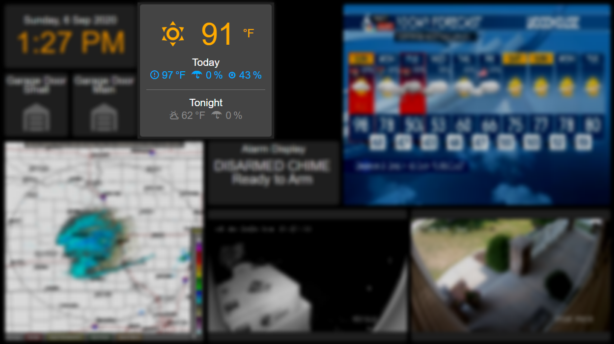

# NWS Day Night CustomWidgets
Home Assistant Appdaemon HADashboard custom weather widget for [Home Assistant NWS Integration](https://www.home-assistant.io/integrations/nws/)



## Installation
It's probably helpful to skim the [HADashboard widget dev docs](https://appdaemon.readthedocs.io/en/latest/WIDGETDEV.html), but not completely necessary. 

Create a `custom_widgets` directory in your appdaemon configuration directory. Copy in `basenwsdaynight` directory and `nwsdaynight.yaml` file.

Add the widget to your dash file.

```
weatherNew:
  widget_type: nwsdaynight
  weather_entity: weather.kmle_daynight
```


If you want your widget style to match mine, include style overrides
```
weatherNew:
  widget_type: nwsdaynight
  weather_entity: weather.kmle_daynight
  title_style: "color: #00aaff"
  unit_style: "color: #ffaa00"
  main_style: "color: #ffaa00; font-size: 150%;"
  sub_style: "color: #00aaff"
  sub_style_tomorrow: "color: #888"
  widget_style: "background-color: #444"
```

When selecting the NWS weather entity, be sure to use the one that ends in _daynight.


## Which Data is Displayed
Current (large):
* Entity state determines icon
* Attribute temperature is displayed as current temperature

Immediate Forecast (Forecast_0):
*  From Attribute Forecast list, first element (0):
    * daytime determines title (Today/Tonight)
    * condition determines icon
    * temperature is shown next
    * precipitation_probability is shown next
  * Attribute humidity is shown last

Upcoming Forecast (Forecast_1):
*  From Attribute Forecast list, second element (1):
  * daytime determines title (Tonight/Tomorrow)
  * condition determines icon
  * temperature is shown next
  * precipitation_probability is shown last

MIT License

Copyright (c) 2020 Ben Johnson
